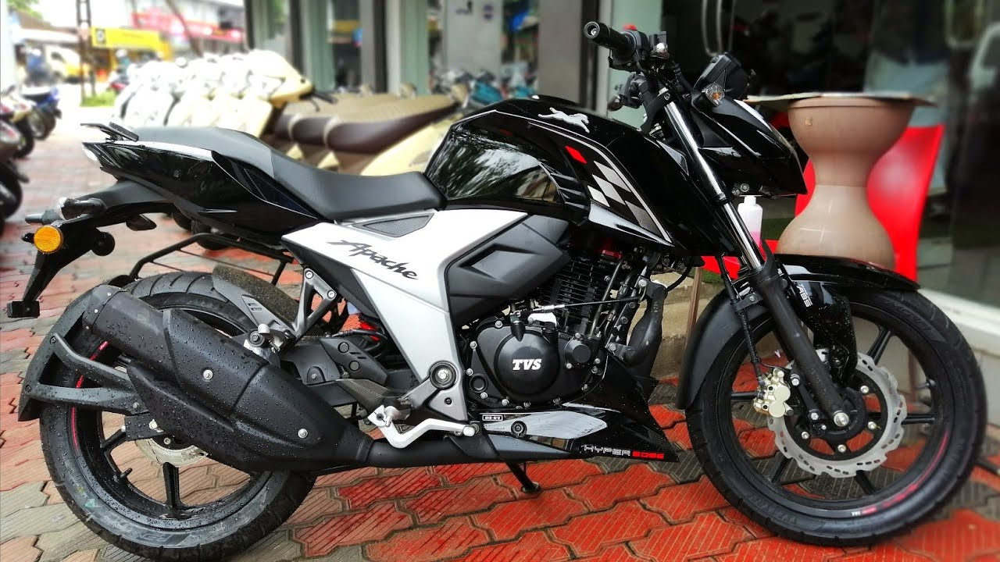
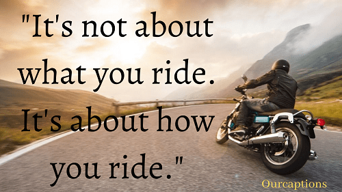

    

   

<h1 align="center">Hi 👋, I'm Ranveer Singh</h1>
<h3 align="center">A Linux Developers from India</h3>

---

# _I Know You are Intrested To Know about my Hobbies Let I Explore Them!_

 

---

## The Small History Behind : How it all started ?
_My Love for bikes started when I was fifteen. It was not something different, but the same usual way of getting attracted to the **speed** and style of the bikes when I was at that age. Who cares if government provides driving license only at the age of 18. I learned to ride bikes at my 8th grade (14 yrs) from my Brother.I got the so called Driving license as soon as I reached 18 (I have to wait for a month because the rule says you must undergo a learning period of 30 days before appearing for test). So What next ? I started troubling my parents to get me the ride that i desired. Indian parents would go bankrupt if they had to buy the bikes that their children wanted 😀 I know I cant ask for a Kawasaki Ninja , Ducati or a Harley Davidson.. In 2020 I Purchesed from my own money and It was Apache RTR 160 4v BS6 ABS._

## What Defines a Biker ? How actually does it feels to ride ?

 

_When it comes to be a biker, there is something more than doing the actual riding thing and that is **The Inner Joy**. When you are traveler cum biker then I bet there is more adventure in your rides. A passionate rider always just cares for riding. **A path is enough and not the place where it leads**. According to me A rider gets joy out of riding than of the places he visits. Doesn’t matter if it going to be 1500 km or 50 km but it is the satisfaction that matters the most when you ride.**You feel yourself to be in full freedom to do whatever you like to do**._

## Some Undefined Moments 

- The Joy that I get when I ride on a straight stretch of road, enjoying the sunrise or sunset.
- The Thrill that I get when I ride in pitch darkness on empty roads where my head beam light uncovers the road ahead not aware of having a Speed breaker or a pit.
- The Joy that I get when my bike’s rpm meter hits the max value, clocking top speed or beating my previous own record.
- The Joy that I get when I ride with my helmets off on a rainy day.
- The Joy that I get when I make my way correctly to my destination even after losing my track in between.
- The Joy that I get when some unknown people appreciate me for offering them a lift on time.

    

