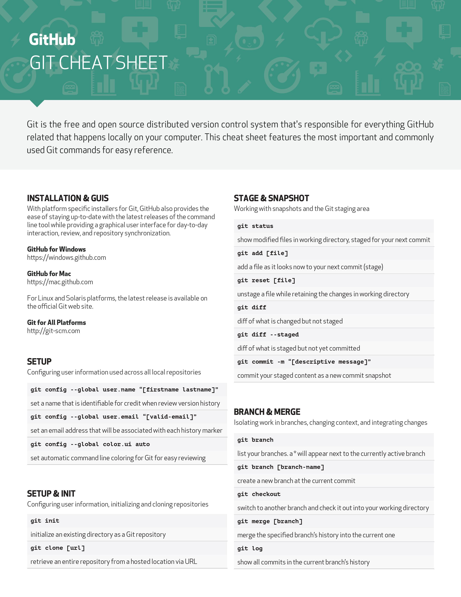
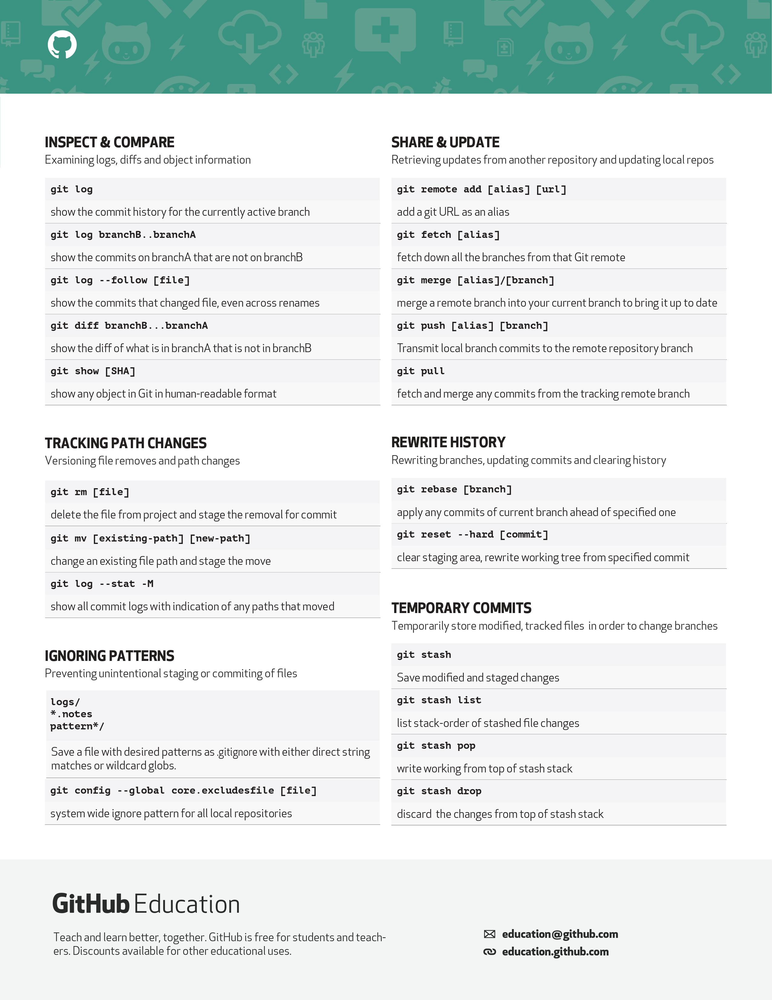

<div align="center">
    
</div>
<p align="left">   </p>

<h1 align="center">Hi 👋, I'm Ranveer Singh</h1>

## Table of Content
- [What I Learn ?](#What_I_Learn_?)
- [What’s a version control system?](#What’s_a_version_control_system?)
- [What’s a distributed version control system?](#What’s_a_distributed_version_control_system?)
- [Why Git?](#Why_Git)
- [What’s a repository?](#What’s_a_repository)
- [How GitHub fits in ?](#How_GitHub_fits_in_?)
- [How GitHub works ?](#How_GitHub_works_?)
- [The GitHub flow ?](#The_GitHub_flow_?)
- [Install](#Install)
   - [Configure tooling](#Configure_tooling)
   - [Create repositories](#Create_repositories)
   - [The .gitignore file](#The_.gitignore_file)
   - [Make changes](#Make_changes)
   - [Redo commits](#Redo_commits)
   - [Glossary](#Glossary)
- [GIT_CHEET_SHEET](#GIT_CHEET_SHEET)
- [Important link](#Important_link)
 
## _What I Learn ?_

### What’s a version control system?
A version control system, or VCS, tracks the history of changes as people and teams collaborate on projects together. As the project evolves, teams can run tests, fix bugs, and contribute new code with the confidence that any version can be recovered at any time. Developers can review project history to find out:

- Which changes were made?
- Who made the changes?
- When were the changes made?
- Why were changes needed?
### What’s a distributed version control system?
Git is an example of a distributed version control system (DVCS) commonly used for open source and commercial software development. DVCSs allow full access to every file, branch, and iteration of a project, and allows every user access to a full and self-contained history of all changes. Unlike once popular centralized version control systems, DVCSs like Git don’t need a constant connection to a central repository. Developers can work anywhere and collaborate asynchronously from any time zone.

Without version control, team members are subject to redundant tasks, slower timelines, and multiple copies of a single project. To eliminate unnecessary work, Git and other VCSs give each contributor a unified and consistent view of a project, surfacing work that’s already in progress. Seeing a transparent history of changes, who made them, and how they contribute to the development of a project helps team members stay aligned while working independently.

### Why Git?

- According to the latest Stack Overflow developer survey, more than 70 percent of developers use Git, making it the most-used VCS in the world. Git is commonly used for both open source and commercial software development, with significant benefits for individuals, teams and businesses.

- Git lets developers see the entire timeline of their changes, decisions, and progression of any project in one place. From the moment they access the history of a project, the developer has all the context they need to understand it and start contributing.

- Developers work in every time zone. With a DVCS like Git, collaboration can happen any time while maintaining source code integrity. Using branches, developers can safely propose changes to production code.

- Businesses using Git can break down communication barriers between teams and keep them focused on doing their best work. Plus, Git makes it possible to align experts across a business to collaborate on major projects.

### What’s a repository?

A repository, or Git project, encompasses the entire collection of files and folders associated with a project, along with each file’s revision history. The file history appears as snapshots in time called commits, and the commits exist as a linked-list relationship, and can be organized into multiple lines of development called branches. Because Git is a DVCS, repositories are self-contained units and anyone who owns a copy of the repository can access the entire codebase and its history. Using the command line or other ease-of-use interfaces, a git repository also allows for: interaction with the history, cloning, creating branches, committing, merging, comparing changes across versions of code, and more.

Working in repositories keeps development projects organized and protected. Developers are encouraged to fix bugs, or create fresh features, without fear of derailing mainline development efforts. Git facilitates this through the use of topic branches: lightweight pointers to commits in history that can be easily created and deprecated when no longer needed.

Through platforms like GitHub, Git also provides more opportunities for project transparency and collaboration. Public repositories help teams work together to build the best possible final product.

### How GitHub fits in ?

GitHub is a Git hosting repository that provides developers with tools to ship better code through command line features, issues (threaded discussions), pull requests, code review, or the use of a collection of free and for-purchase apps in the GitHub Marketplace. With collaboration layers like the GitHub flow, a community of 15 million developers, and an ecosystem with hundreds of integrations, GitHub changes the way software is built.

### How GitHub works ?
GitHub builds collaboration directly into the development process. Work is organized into repositories, where developers can outline requirements or direction and set expectations for team members. Then, using the GitHub flow, developers simply create a branch to work on updates, commit changes to save them, open a pull request to propose and discuss changes, and merge pull requests once everyone is on the same page.

### The GitHub flow ?
The GitHub flow is a lightweight, branch-based workflow built around core Git commands used by teams around the globe—including ours.

The GitHub flow has six steps, each with distinct benefits when implemented:

- Create a branch: Topic branches created from the canonical deployment branch (usually main) allow teams to contribute to many parallel efforts. Short-lived topic branches, in particular, keep teams focused and results in quick ships.
- Add commits: Snapshots of development efforts within a branch create safe, revertible points in the project’s history.
- Open a pull request: Pull requests publicize a project’s ongoing efforts and set the tone for a transparent development process.
- Discuss and review code: Teams participate in code reviews by commenting, testing, and reviewing open pull requests. Code review is at the core of an open and participatory culture.
- Merge: Upon clicking merge, GitHub automatically performs the equivalent of a local ‘git merge’ operation. GitHub also keeps the entire branch development history on the merged pull request.
- Deploy: Teams can choose the best release cycles or incorporate continuous integration tools and operate with the assurance that code on the deployment branch has gone through a robust workflow.

## Install

### Install Git with Yum
The easiest way to install Git and have it ready to use is to use CentOS’s default repositories. This is the fastest method, but the Git version that is installed this way may be older than the newest version available. If you need the latest release, consider compiling git from source (the steps for this method can be found further down this tutorial).

Use yum, CentOS’s native package manager, to search for and install the latest git package available in CentOS’s repositories:
```sh
sudo yum install git
```

If the command completes without error, you will have git downloaded and installed. To double-check that it is working correctly, try running Git’s built-in version check:
```sh
git --version
```
### Configure tooling
Configure user information for all local repositories
```sh
$ git config --global user.name "[name]"
```

Sets the name you want attached to your commit transactions
```sh
$ git config --global user.email "[email address]"
```

Sets the email you want attached to your commit transactions
```sh
$ git config --global color.ui auto
```
Enables helpful colorization of command line output

### Create repositories
A new repository can either be created locally, or an existing repository can be cloned. When a repository was initialized locally, you have to push it to GitHub afterwards.

```sh
$ git init
```

The git init command turns an existing directory into a new Git repository inside the folder you are running this command. After using the git init command, link the local repository to an empty GitHub repository using the following command:

```sh
$ git remote add origin [url]
```

Specifies the remote repository for your local repository. The url points to a repository on GitHub.

```sh
$ git clone [url]
```

Clone (download) a repository that already exists on GitHub, including all of the files, branches, and commits

### The .gitignore file
Sometimes it may be a good idea to exclude files from being tracked with Git. This is typically done in a special file named .gitignore. You can find helpful templates for .gitignore files at github.com/github/gitignore.

Synchronize changes
Synchronize your local repository with the remote repository on GitHub.com
```sh
$ git fetch
```

Downloads all history from the remote tracking branches
```sh
$ git merge
```
Combines remote tracking branches into current local branch
```sh
$ git push
```
Uploads all local branch commits to GitHub
```sh
$ git pull
```
Updates your current local working branch with all new commits from the corresponding remote branch on GitHub. ```sh git pull``` is a combination of ```sh git fetch``` and ```sh git merge```

### Make changes
Browse and inspect the evolution of project files
```sh
$ git log
```
Lists version history for the current branch
```sh
$ git log --follow [file]
```
Lists version history for a file, beyond renames (works only for a single file)
```sh
$ git diff [first-branch]...[second-branch]
```
Shows content differences between two branches
```sh
$ git show [commit]
```
Outputs metadata and content changes of the specified commit
```sh
$ git add [file]
```
Snapshots the file in preparation for versioning
```sh
$ git commit -m [descriptive message]
```
Records file snapshots permanently in version history

### Redo commits
Erase mistakes and craft replacement history
```sh
$ git reset [commit]
```
Undoes all commits after [commit], preserving changes locally
```sh
$ git reset --hard [commit]
```
Discards all history and changes back to the specified commit ``` CAUTION! Changing history can have nasty side effects. If you need to change commits that exist on GitHub (the remote), proceed with caution. ```

### Glossary
- **git:** an open source, distributed version-control system
- **GitHub:** a platform for hosting and collaborating on Git repositories
- **commit:** a Git object, a snapshot of your entire repository compressed into a SHA
- **branch:** a lightweight movable pointer to a commit
- **clone:** a local version of a repository, including all commits and branches
- **remote:** a common repository on GitHub that all team members use to exchange their changes
- **fork:** a copy of a repository on GitHub owned by a different user
- **pull request:** a place to compare and discuss the differences introduced on a branch with reviews, comments, integrated tests, and more
- **HEAD:** representing your current working directory, the HEAD pointer can be moved to different branches, tags, or commits when using git checkout

### GIT_CHEET_SHEET

<details align="left">
  <summary> 
Click Hare for Details in Visual :arrow_down:
    </summary>
<p> </p>
</details>
<details align="left">
  <summary> 
Click Hare for Details in Visual :arrow_down:
    </summary>
<p> </p>
    </details>
    
### Important Link
- [Git Documentation](https://git-scm.com/doc)
- [Git Book](https://git-scm.com/book/en/v2)
- [Git Book Direct Download](https://github.com/progit/progit2/releases/download/2.1.300/progit.pdf)


 <div align="center">
    
</div>
